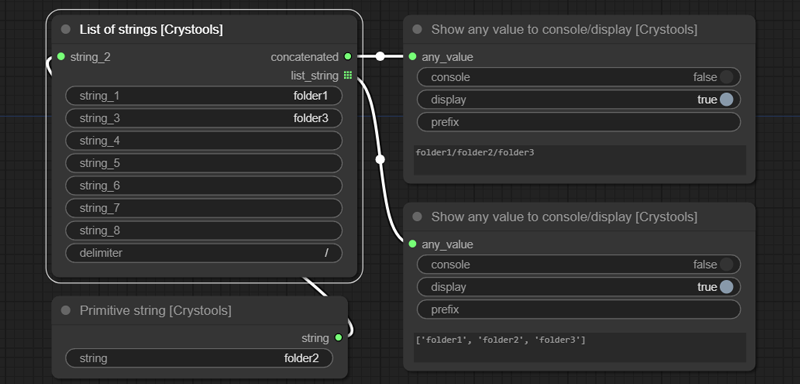
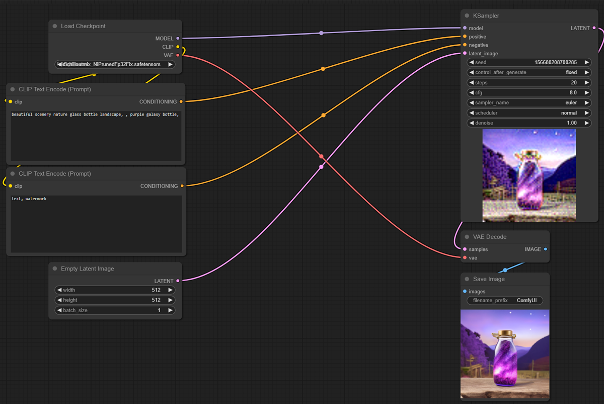
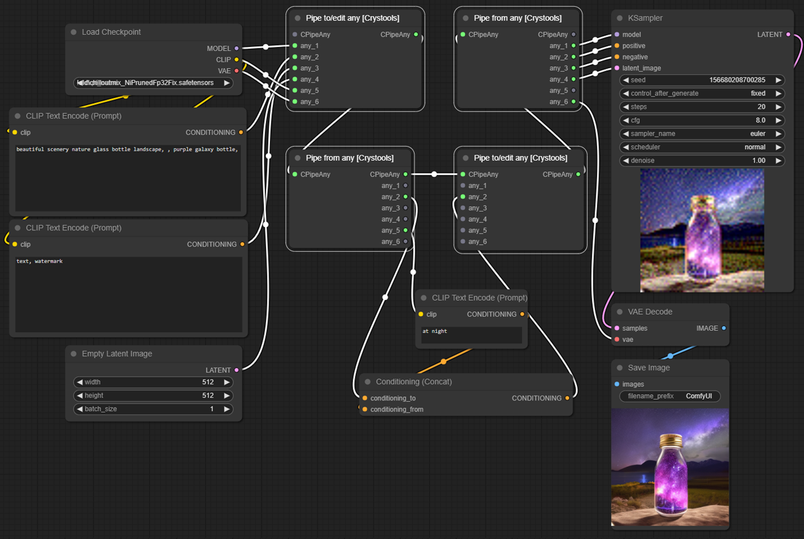
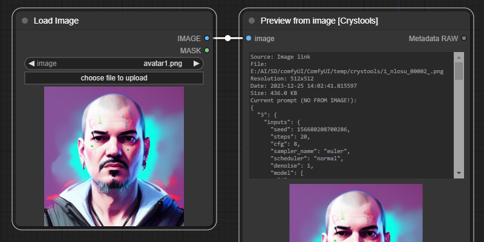
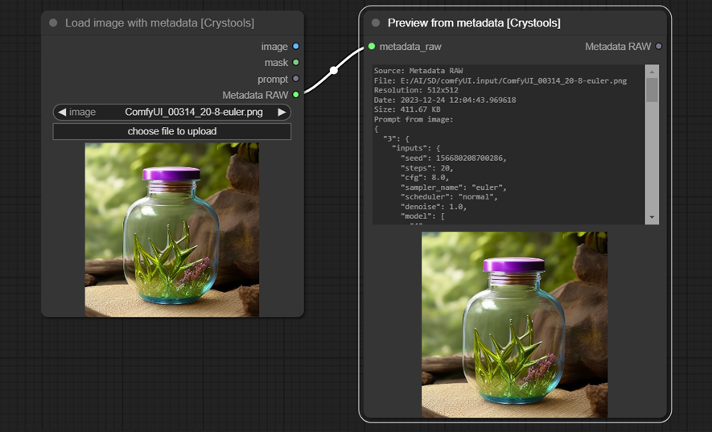
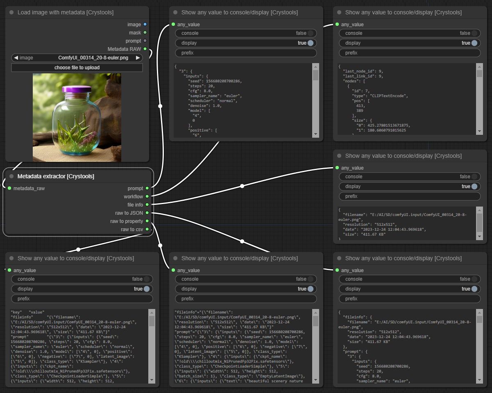
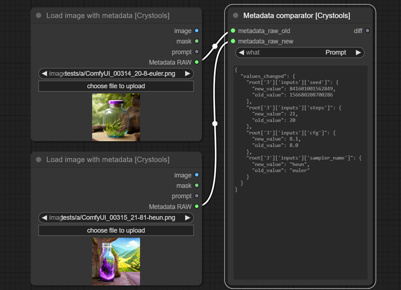

# ComfyUI-Crystools

**_A powerful set of tools for your belt when you work with ComfyUI_**

Show metadata, compare between two JSONs, compare between two images, show any value to console/display, pipes, and more!


## Debugger

### Node: Show Metadata

With this node, you will be able to see the JSON produced from your entire prompt and workflow so that you can really know all the values (and more) of your prompt quickly without the need to open the file (PNG or JSON).


><details>
>  <summary><i>Parameters</i></summary>
>
> - Options:
>   - Active: Enable/disable the node  
>   - Parsed: Show the parsed JSON or plain text  
>     - What: Show the prompt or workflow (prompt are values to produce the image, and workflow is the entire workflow of ComfyUI)
></details>

### Node: Show any value to console/display

You can practically see any text or data from the nodes. Connect it to what you want to inspect, and you will see it.


><details>
>  <summary><i>Parameters</i></summary>
>
> - Input:
>  - any_value: Any value to show, can be a string, number, etc.
> - Options:
>  - Console: Enable/disable write to console  
>  - Display: Enable/disable write on this node  
>  - Prefix: Prefix to console
></details>

### Node: Show any value to JSON

As same the previous one, but it formatted the value to JSON (only display).


><details>
>  <summary><i>Parameters</i></summary>
>
> - Input:
>  - any_value: Any value to try to convert to JSON
> - Output:
>  - string: The same string is shown on display
></details>

## Primitives

### Nodes: Primitive boolean, Primitive integer, Primitive float, Primitive string, Primitive string multiline

A set of nodes with primitive values to use in your prompts.


## List
A set of nodes with list of values (any or strings/texts) for any propose (news nodes to use it coming soon!).

> **Important:** You can use with others nodes like "Show any" to see the values of the list

### Node: List of strings
Even you can concatenate them



><details>
>  <summary><i>Parameters</i></summary>
>
> - Input:
>  - string_*: 8 possible inputs to use
>  - delimiter: Use to concatenate the values on output
> - Output:
>  - concatenated: A string with all values concatenated
>  - list_string: The list of strings (only with values)
></details>

### Node: List of any
You can concatenate any value (it will try to convert to string and show the value), so util to see several values at the same time.


><details>
>  <summary><i>Parameters</i></summary>
>
> - Input:
>  - any_*: 8 possible inputs to use
> - Output:
>  - list_any: The list of any elements (only with values)
></details>

## Switch
A set of nodes to switch between flows.  

All switches are boolean, you can switch between flows by simply changing the value of the switch.  
You have predefined switches (string, latent, image, conditioning) but you can use "Switch any" for any value/type.


## Pipe

### Nodes: Pipe to/edit any, Pipe from any

This powerful set of nodes is used to better organize your pipes.  

The "Pipe to/edit any" node is used to encapsulate multiple links into a single one. It includes support for editing, easily adding the modified content back to the same pipe number.

The "Pipe from any" node is used to extract the content of a pipe.  

>**Important:**
>- Please note that it supports "any," meaning it does not validate (not yet!) the correspondence of input nodes with the output ones. When creating the link, it is recommended to link consciously number by number.
>- "RecursionError", It's crucial to note that the flow of links **must be in the same direction**, and they cannot be mixed with other flows that use the result of this one. Otherwise, this may lead to recursion and block the server (you need to restart it!)
 
Typical example:



With pipes:


Editing pipes:



Bad example with "RecursionError: maximum recursion depth exceeded":


## Image
### Node: Load image with metadata
This node is the same as the default one, but it adds three features: Prompt, Metadata, and supports **subfolders** of the "input" folder.


><details>
>  <summary><i>Outputs</i></summary>
>
>  - Image/Mask: The same as the default node  
>  - Prompt: The prompt used to produce the image (not the workflow)  
>  - Metadata RAW: The metadata raw of the image (full workflow) as string
></details>

**Note:** The subfolders support is by: [comfyui-imagesubfolders](https://github.com/catscandrive/comfyui-imagesubfolders)

### Node: Show resolution
This node is used to show the resolution of the image.

> Can be used with any image link.


### Node: Preview from image
This node is used to preview the image with the **current prompt** and additional features.  


**Feature:** It supports cache (shows as "CACHED"), so you can disconnect the node and still see the image and data, so you can use it to compare with others!

  
You can see the seed, steps, and cfg were changed

**Notes/features:**  
- Additional feature: This node has an output as metadata raw, **you can use to compare with others!** (see [metadata comparator](#node-metadata-comparator))
- Additional data: Shows the filename, resolution, datetime and size with **the current prompt, not the original one!** (see detail).
><details>
>  <summary><i>Sample of notes</i></summary>
>
> All the data even the prompt shown is from the temporal image, **not the original one!**

></details>

> **Important:**
> - If you want to read the metadata of the image, you need to use the [load image with metadata](#node-load-image-with-metadata) and use the output "metadata RAW" not image.
> - To do a preview it is necessary save it first on temporal folder, and the data shown is from the temporal image, **not the original one**.


><details>
>  <summary><i>Outputs</i></summary>
>  
>  - Metadata RAW: The metadata raw of the image (full workflow) as string
></details>

### Node: Preview from metadata
This node is used to preview the image from the metadata and shows additional data (all around this one).  
It supports same features as [preview from image](#node-preview-from-image) (cache, metadata raw, etc).
 


## Metadata
### Node: Metadata extractor
This node is used to extract the metadata from the image and handle it as a JSON as source for other nodes.
You can see **all information**, even metadata from others sources (like photoshop).

The input can be from the [load image with metadata](#node-load-image-with-metadata) or [preview from image](#node-preview-from-image) nodes.



><details>
>  <summary><i>Other metadata sample</i></summary>
> 
> With metadata from Photoshop

></details>

><details>
>  <summary><i>Outputs</i></summary>
>  
>  - Prompt: The prompt used to produce the image.
>  - Workflow: The workflow used to produce the image (all information about nodes, values, etc).
>  - file info: The file info of the image/metadata (resolution, size, etc) as human readable.
>  - raw to JSON: The entire metadata raw but formatted/readable.
>  - raw to property: The entire metadata raw as "properties" format.
>  - raw to csv: The entire metadata raw as "csv" format.
></details>

### Node: Metadata comparator
This node is so useful to compare two metadata and see the differences (**the reason why I created this extension!**)

You can compare 3 inputs: "Prompt", "Workflow" and "Fileinfo"

There are tree potential "outputs": `values_changed`, `dictionary_item_added`, `dictionary_item_removed` (in this order of priority).



**Notes:**  
I use [DeepDiff](https://pypi.org/project/deepdiff) for that.  
If you want to compare two JSONs, you can use the [JSON comparator](#node-JSON-comparator) node.

><details>
>  <summary><i>Outputs</i></summary>
>  
>  - Diff: This is the same output you can see in the display of the node, you can use it on others nodes.
></details>

## Utils
Some useful nodes to use in your workflow.

### Node: JSON comparator
This node is so useful to compare two JSONs and see the differences.


### Node: Stat system

More info and works:
ig

buscar con oo

primerp pryecto en python

todo
test
persistir imagen
no sobrevive al f5 por mas que se vea la data
agregar desde menu o doble click
log
persisitr data

mostrar primioro show any, creo que es por que es js puro

## Installation


### Install from GitHub
1. Install [ComfyUi](https://github.com/comfyanonymous/ComfyUI).
2. Clone this repo into `custom_modules`:
    ```
    cd ComfyUI/custom_nodes
    git clone https://github.com/crystian/ComfyUI-Crystools.git
    ```
3. Start up ComfyUI.

### Install from manager

Search for `crystools` in the [manager](https://github.com/ltdrdata/ComfyUI-Manager.git) and install it.


